#  Universal Homelab Server

<video src="images/Video.mp4" controls="controls" style="max-width: 730px;">
</video>

*Consolidating multi-server operations into a custom-engineered 4U chassis.*

* System Overview
* Hardware
* Cooling
* Cybersecurity
* DNS Configuration

---

##  System Overview

  <table>
    <tr>
      <td width="50%" align="center">
        <b>Server Rack</b>  
        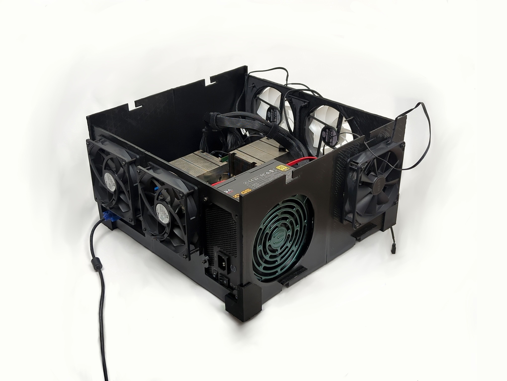
      </td>
      <td width="50%" align="center">
        <b>Server Rack 3D view</b>  
        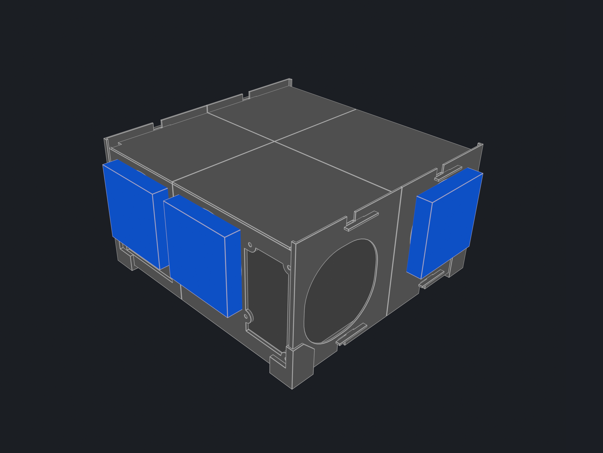
      </td>
    </tr>
  </table>

  <table>
    <tr>
      <td width="50%" align="center">
        <b>Server Rack Overview Profile</b>  
        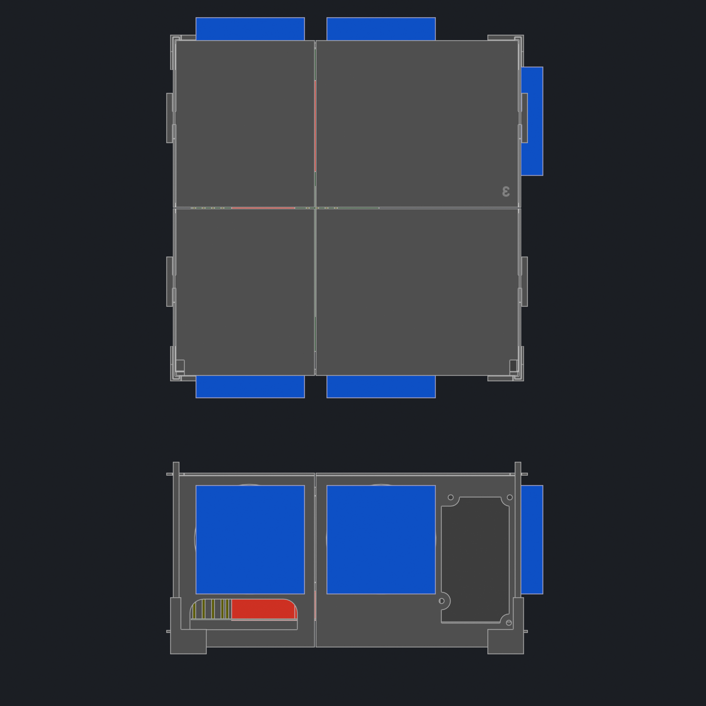
      </td>
      <td width="50%" align="center">
        <b>Internal Hardware Configuration</b>  
        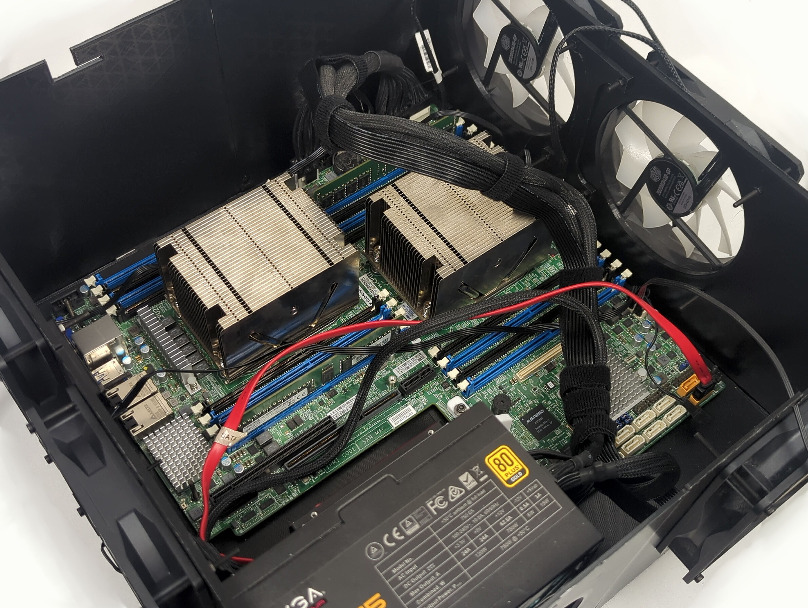
      </td>
    </tr>
  </table>

---

The purpose of this project is to consolidate 4 different DIY server machines into one convinient home solution.

I have been using 4 Dell Optiplex office computers for all my homelab server needs.

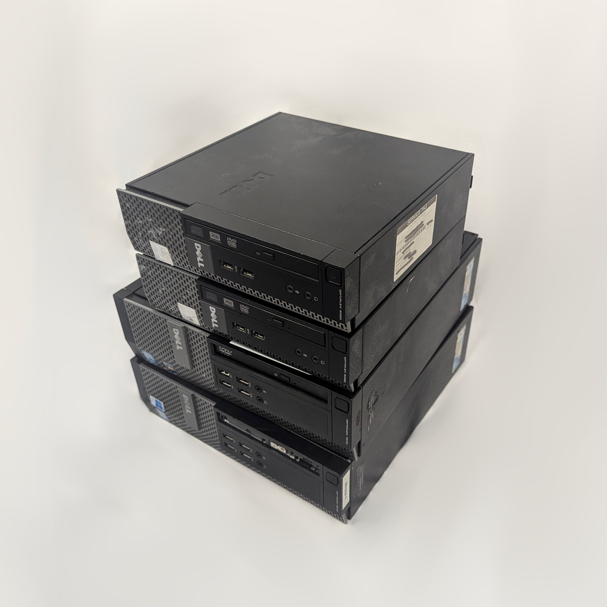

These were used for game servers, like Minecraft and Project Zomboid as well as other purposes like Joplin note sharing server.

It is a much better idea to combine all these server tasks into one powerfull machine instead of spreading it accross multiple power inefficient old computers, which was the goal of this personal project.

In addition to the old tasks I also want to add a file sharing server and a local DNS server to the list.

This project incdules a bunch of physical hardware improvements as well as networking redesign. This document is more focused on the hardware since most of the software migration was simple to implement.

This document is an overview of the project with some details ommited for the sake of presentaiton. No generative AI was used in making of this project

Minecraft server is setup using a premade docker project by itzg: https://github.com/itzg/docker-minecraft-server 

##  Hardware
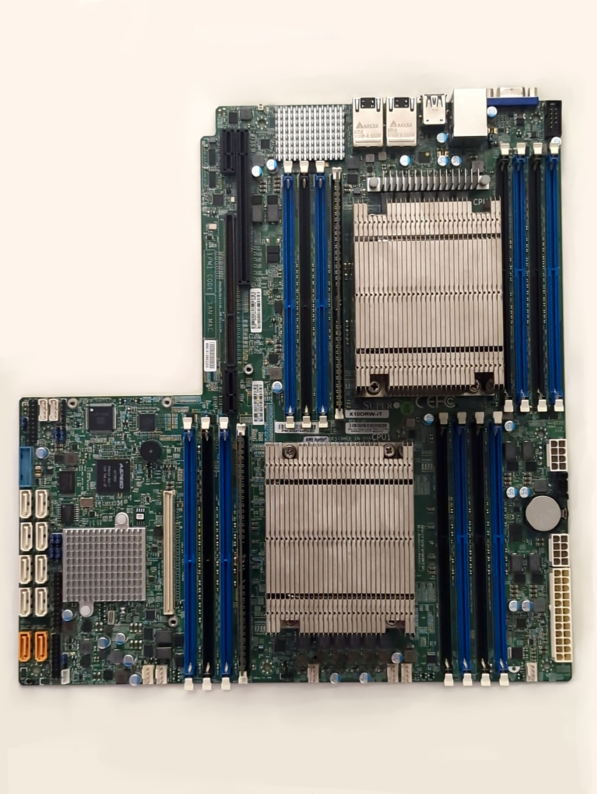

MB: X10DRW-iT

DIMM: DDR4 ECC RDIMM 2133MHz

CPU: 2 X Intel Xeon E5-2630 V4

PSU: EVGA 750W G5

HDD: 126 GB Samsung Sata SSD

For all my server tasks I chose a second hand server motherboard that is versitile and has plenty of upgradability. Because of current RAM price situation I only bought one DIMM for each CPU, but later I could add in more modules if the system requires more RAM.

Last generation server hardware is mostly compatible with regular commertical PC components like Power Supplies and SATA Drives. 
However server power delivery systems often use proprietary ways to deliver power like busbars and card edge connectors(DELL PSU example below), which create a need to purchase additional proprietary hardware for interfacing.

  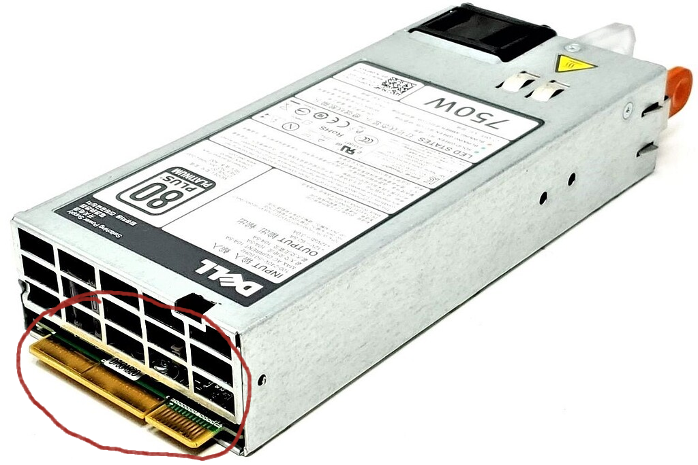

By using a regular desktop PC power supply we can deliver the same result without the additional difficulties that come with server power delivery solutions. That is why I used my robust used EVGA power supply that can meet the power requirement of running this motherboard together with the two CPUs with safe headroom.

To house all necessary components I designed and 3D printed a case that rigidly connects all necessary components together. The case comes with removable top cover, similar to enterprise server trays, for easy servicing of the interior components.

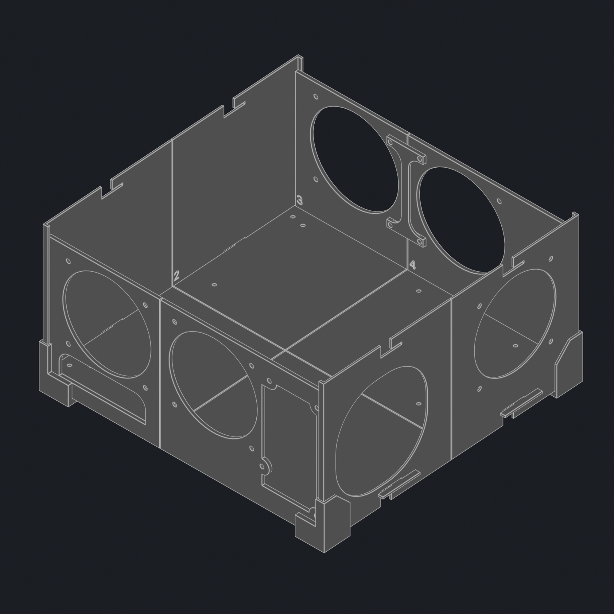

##  Cooling

This server has unique limitations when it comes to its cooling environment. Typically datacenters are their own facilities where the amount of noise that is created by machines is very low on the priority list. Since this unique server is deployed in a living space, the server should not add significant ammount of noise into the envoronment under a regular load. 

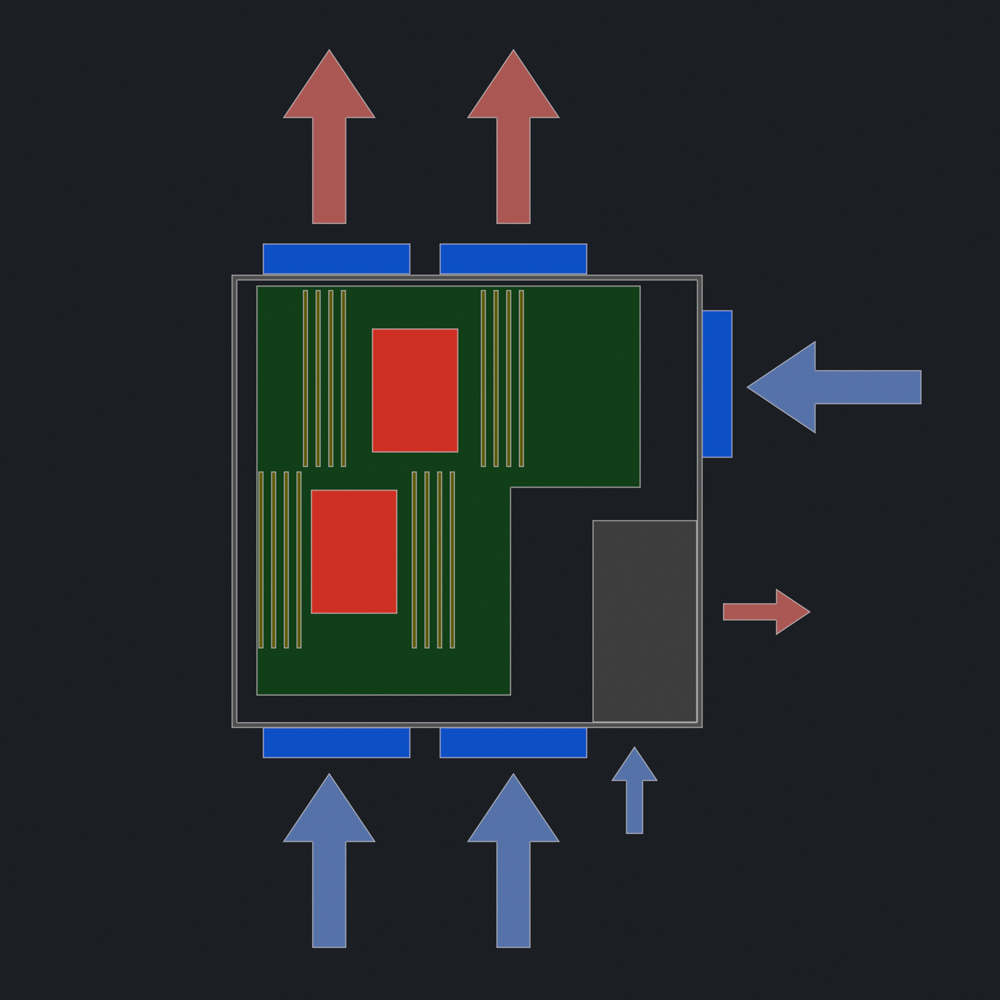
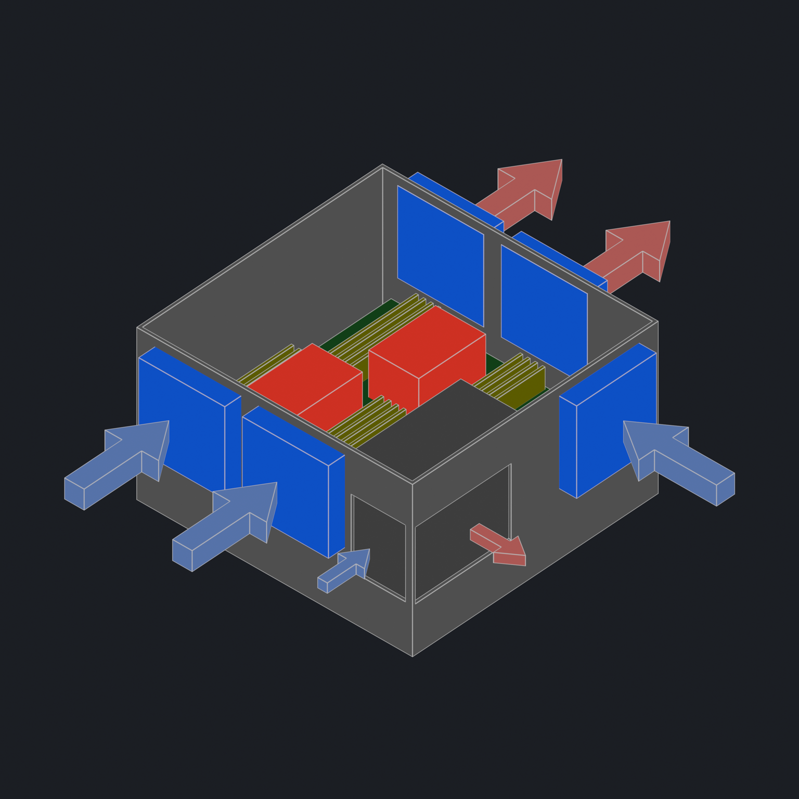

In addition to the airflow, I have replaced the 1U heatsinks that came with the motherboard with 2U taller heatsinks for improved heat dissipation.

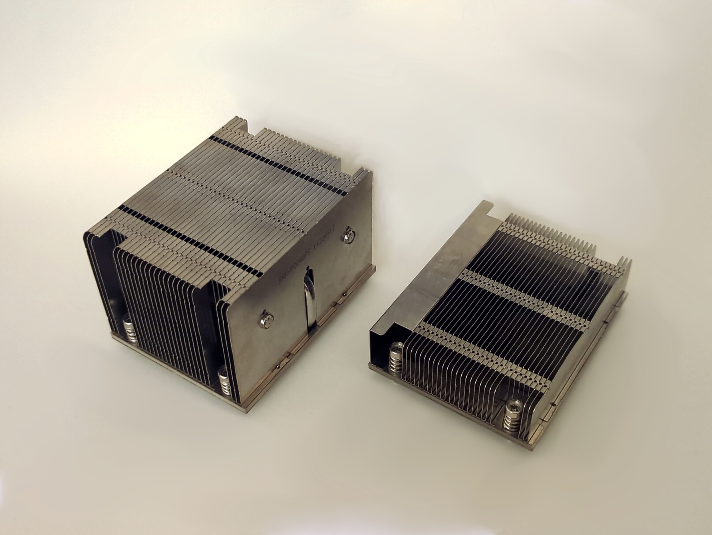

##  Cybersecurity
While being an administrator of a game server I found out that there are series of botnets that constantly scan the entire IP range for the typical port number for any given game. For example, a typical port for a minecraft server is TCP/25565, which is constantly being scanned by bad actors and server indexers.
Here is an example on a typical day sometimes with thousands of requests per day:

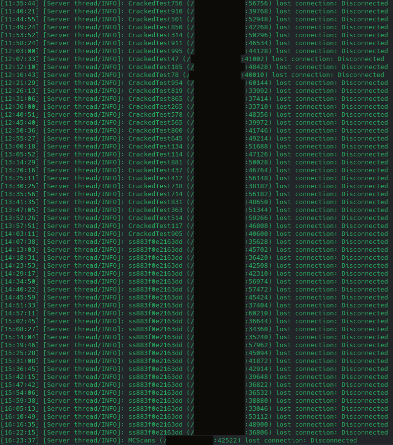

These entities mainly exist to index all avaliable community servers for a game, which is by itself harmess but has caused malicious actors to try to connect to our server.
Main security feature that helps prevent this is using a whitelist of users. Administrators and trusted users can add new players onto the list which lets them connect.
Even though whitelist mostly solves this issue, there are cases where a whitelist needed to be turned off for technical reasons, which would make this a potential voulnurability.

I have been able to manually detect and ban malicious actors by reviewing logs and adding Linux UFW rules, but this requires me to do it every day so I need to have a more automated solution.
Since minecraft server itself does not provide ways to deal with bad actors there are various community tools that will be implemented for this task like Fail2Ban and PSAD.

Fail2Ban automatically detects and bans IPs that make too many failed attempts at connecting too quickly.
PSAD(Port Scan Attack Detector) analyzes iptable logs to identify port scanners and suspicious network connections. 

These tools come at a risk of flagging innocent users with a false positive. This risk is mitigated by the fact that the userbase is small and has direct line of contact with me and other admins to mitigate any issues. 

###  DNS Configuration

In order to connect to a game server we need to give our clients an IP address and a port number.
To make this process a little more convininet for the average user I have added a custom domain so that 

Here is an example of Cloudflare setup for our Minecraft server:

A MC.#####.org
SRV _minecraft._tcp.mc 25565

A record points to the IP address of the server. SRV record of port 25565 is the standard used for many minecraft servers.

Although because of the reasons outlined in the cybersecurity section this port number will be changed to a random one to avoid scraping.

